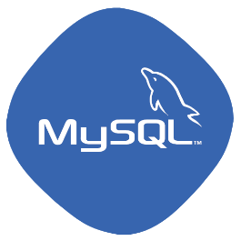
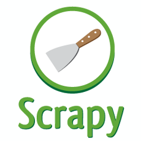

# Money Podcast App - BackEnd Project

**開發於 : 2020年底**

## GCP
  
專案架設於GCP Ubuntu環境上
## Mysql Database
  
  

## PushSharp
      
利用開發者帳號創建憑證，然後透過APP取得Device Token，然後再使用ANPS(Apple notification push server)推播至手機端。

## ASP.NET Core
      
服務都是使用 .NET Core撰寫，有實現了非同步及身分驗證
非同步 – 各服務請求與響應時間不同
身分驗證 – 假設Header沒有帶入合法Token，API請求將會被阻絕。

## ELK (Elasticsearch, Logstash, Kibana)
      
將舊有的LOG寫檔形式，透過Logstash轉換成自定義形式，並存入Elasticsearch資料庫，最後透過Kibana圖形化介面視覺化LOG。

* 舊有形式
  
 
* 使用Kibana展現
  

## Scrapy
      
透過Scrapy 爬取每位作者的RSSFeed網址，獲取各單集資訊。
